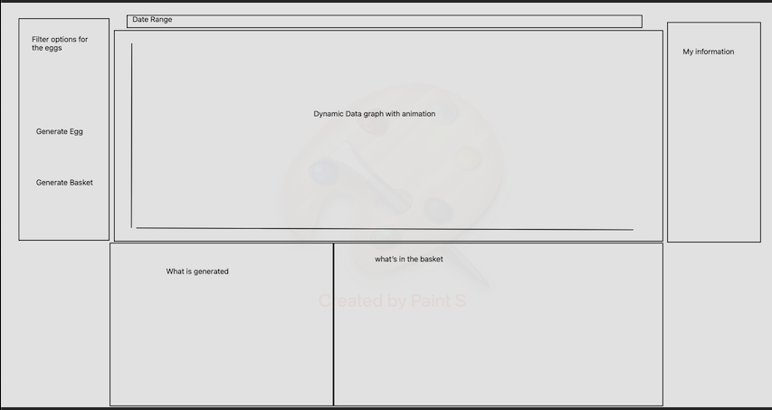

# The-Golden-Basket

The Golden Basket is a data visualization/interactive demo that introduces
the concept of diversification and opportunity cost. User will have different
data manipulations options such as sectors and time ranges.

# MVP 
1.Users will be able to generate a random Egg(stock) until 5 eggs
    or random basket(5 stocks)that compares to the Vanguard s&p500 ETF.

2.Graph will dynamically plot performance of generated egg or basket individual performance.
    
3.Users will have filter options for dates.

Bonus Feature: 
    -compare to other stocks or other mutual funds.
    -cryptoegg
    -email user- bakset/egg info

# Wireframe

# Technologies
CSS, Javascript, Chart JS, Canvas

# Implementation timeline

**Friday** 

    - Input boxes, text rendering, buttons.

**Saturday**

    - Dynamic API data fetching, introduce animations.(incorporating Canvas API & D3)

**Sunday***

    - Dynamic API data fetching, introduce animations.(incorporating Canvas API & D3)

**Monday**

    - Finish animations.

**Tuesday**

    -Make sure all buttons and animations are smooth.

**Wednesday**

    -Css touch up. Make project more presentable, color coordination

**Thursday**

    -bonus: incorporate the bonuses if there is enough time left.
